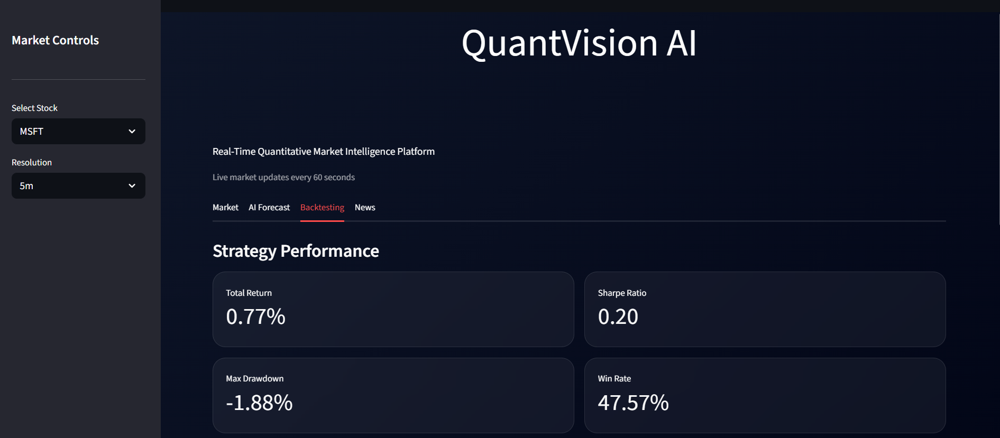
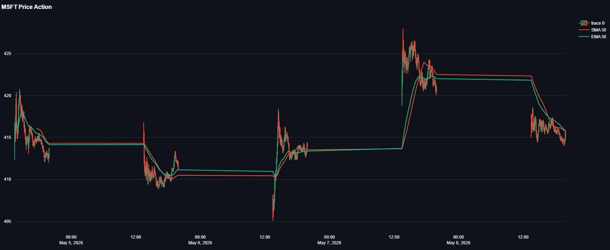

# QuantVision AI

## Real-Time Quantitative Market Intelligence Platform

QuantVision AI is an AI-powered quantitative trading and market intelligence platform designed for real-time financial analytics, AI-driven forecasting, technical analysis, sentiment intelligence, and quantitative strategy backtesting.

The platform integrates deep learning, live market data, algorithmic trading signals, and interactive visual analytics into a unified Streamlit dashboard.

---

# Features

## Market Analytics
- Real-time stock market monitoring
- US & Indian market support
- Interactive candlestick visualizations
- Multi-timeframe analysis

## AI Forecasting Engine
- GRU-based deep learning prediction model
- AI-driven market direction forecasting
- Confidence score generation
- Quantitative signal generation

## Technical Indicators
- RSI (Relative Strength Index)
- MACD (Moving Average Convergence Divergence)
- SMA / EMA (Simple Moving Average / Exponential Moving Average)
- Momentum indicators
- Volatility analysis

## Sentiment Intelligence
- Financial news aggregation
- NLP-based sentiment analysis
- Real-time market sentiment tracking

## Quantitative Trading
- AI trading signals
- BUY / SELL / HOLD recommendations
- Strategy performance comparison
- Market vs AI equity curves

## Backtesting Engine
- Historical strategy simulation
- Sharpe Ratio calculation
- Max Drawdown analysis
- Win-rate evaluation
- Cumulative return tracking

---

# Tech Stack

| Category | Technologies |
|---|---|
| Frontend | Streamlit |
| Visualization | Plotly |
| AI / Deep Learning | TensorFlow, Keras |
| Machine Learning | Scikit-learn |
| Data Processing | Pandas, NumPy |
| Market Data | yFinance, Finnhub API |
| NLP / Sentiment | Deployment |
| Hugging Face Spaces |

---

# System Architecture

```text
Live Market Data
        ↓
Feature Engineering
        ↓
Technical Indicators
        ↓
GRU Deep Learning Engine
        ↓
Signal Generation
        ↓
Backtesting Engine
        ↓
Interactive Dashboard
```

---

# Dashboard Preview



---

## Market Analysis View



---

# Installation

## Clone Repository

```bash
git clone https://github.com/manimozhi-ds/quantvision-ai.git

cd quantvision-ai
```

---

## Install Dependencies

```bash
pip install -r requirements.txt
```

---

## Configure Environment Variables

Create a `.env` file in the root directory:

```env
FINNHUB_API_KEY=your_finnhub_key
NEWS_API_KEY=your_newsapi_key
```

---

## Launch Application

```bash
streamlit run app.py
```

---

# Live Deployment

The application is deployed on Hugging Face Spaces for real-time public access.

Deployment Platform:
- Hugging Face Spaces
- Streamlit Runtime
- Cloud-based AI Inference


---

## Live Demo

https://huggingface.co/spaces/manimozhi-ds/QuantVision-AI

---

# Supported Markets

- US Equities
- Indian Equities
- Market Indices
- Real-Time Financial Data Streams

---

# Key Capabilities

- Deep Learning Forecasting
- Quantitative Trading Analytics
- Real-Time Financial Intelligence
- Market Sentiment Tracking
- Technical Signal Generation
- Strategy Backtesting

---

# Future Improvements

- Transformer-based forecasting models
- Reinforcement learning trading agents
- Portfolio optimization engine
- Real-time websocket infrastructure
- Multi-asset portfolio tracking
- Institutional-grade risk analytics

---

# License

This project is licensed under the MIT License.

---

# Author

Developed by Manimozhi Sekar.
